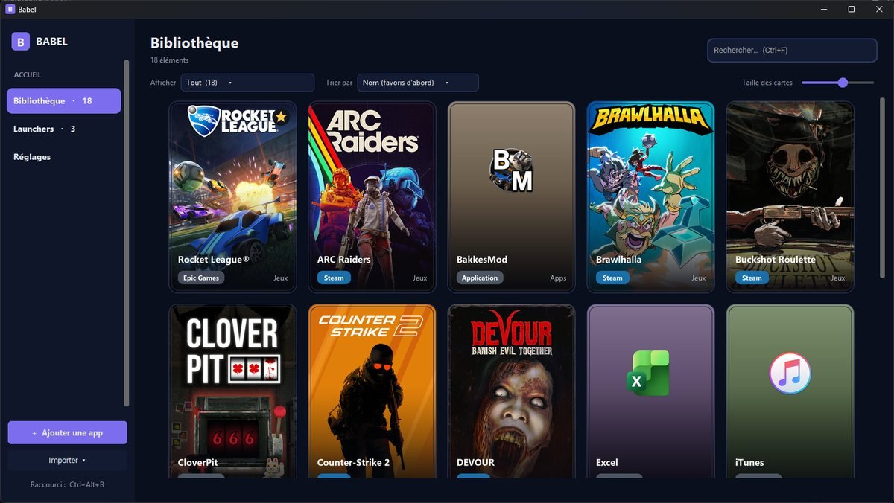
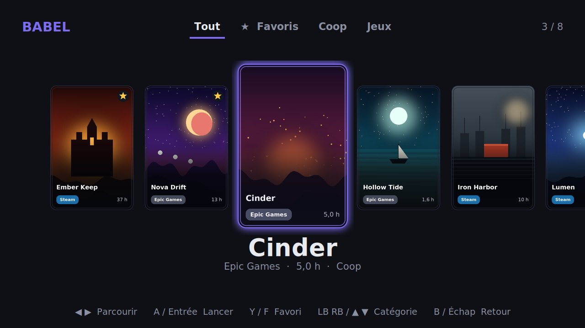
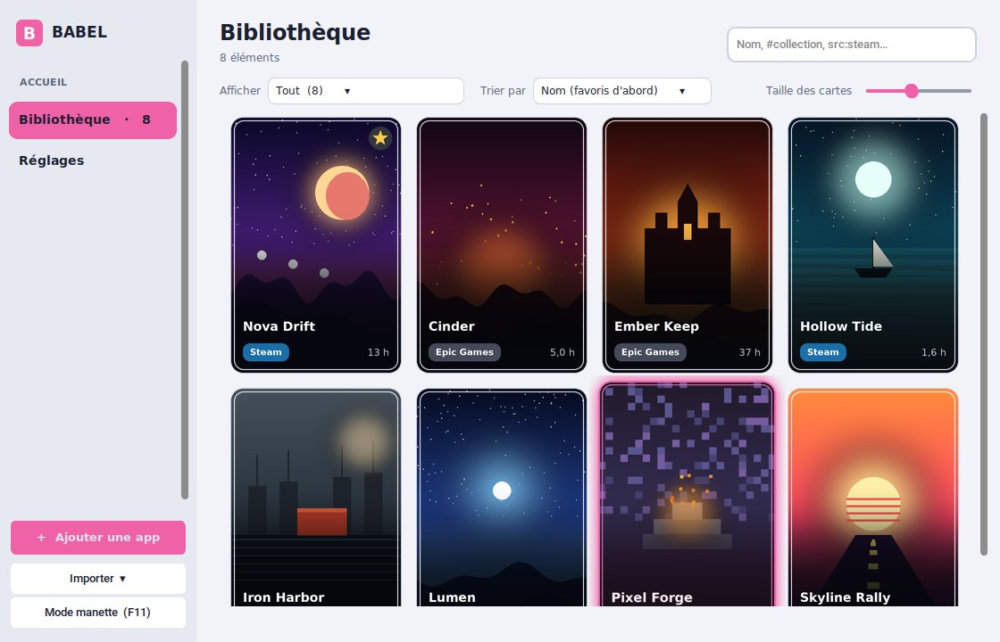

[English](README.md) · **Français**

# Babel

**Tous tes jeux, une seule bibliothèque.**

Un lanceur de jeux et d'applications pour Windows, simple et joli. 
Steam, Epic, Riot, GOG, Battle.net, EA et tes applis, rangés dans une vraie collection de cartes.

### [⬇ Télécharger Babel](https://github.com/ov3rfoxe/babel/releases/latest) · [Site officiel](https://ov3rfoxe.github.io/babel/) · [Signaler un bug](https://ov3rfoxe.github.io/babel/feedback.html)

## Pourquoi Babel ?

Tes jeux sont éparpillés entre cinq lanceurs différents, et tu ne sais plus où est quoi. Babel les regroupe tous au même endroit, avec leurs vraies jaquettes, et les lance en un clic. Pas de compte à créer, pas de pub, rien n'est envoyé en ligne.

## Ce que fait Babel

- **Import en un clic.** Babel trouve tout seul tes jeux Steam, Epic Games, Riot, GOG, Battle.net et EA, et les applications de ton menu Démarrer.
- **Vraies jaquettes.** Les affiches viennent de Steam et de SteamGridDB, même pour les jeux hors Steam comme Valorant ou Rocket League.
- **Mode manette.** Appuie sur F11 ou sur Start : Babel passe en plein écran avec de grosses cartes, à parcourir à la manette comme sur une console.
- **Collections.** Range tes jeux comme tu veux : « Coop », « À finir », « Soirée entre potes »…
- **Temps de jeu.** Babel affiche ton temps de jeu Steam, et compte aussi celui de tes autres jeux.
- **Recherche intelligente.** Tape `#coop`, `src:steam`, `cat:jeux` ou `is:fav` dans la barre de recherche, et combine-les.
- **Raccourci global.** `Ctrl + Alt + B` ouvre ou cache Babel depuis n'importe où, même en plein jeu.
- **À tes couleurs.** Cinq ambiances (Nuit, Noir, Ardoise, Minuit, Clair) et la couleur d'accent de ton choix.
- **Glisser-déposer.** Dépose un raccourci ou un `.exe` sur la fenêtre et il rejoint ta bibliothèque.
- **Mises à jour automatiques.** Babel te prévient quand une nouvelle version sort et l'installe pour toi.

<table>
<tr>
<td width="50%"></td>
<td width="50%"></td>
</tr>
<tr>
<td align="center">Le mode manette</td>
<td align="center">Le thème Clair, accent rose</td>
</tr>
</table>

## Installation

1. Télécharge le fichier `Babel-Setup-….exe` depuis la [dernière version](https://github.com/ov3rfoxe/babel/releases/latest).
2. Lance-le. Pas besoin de droits administrateur.
3. Au premier lancement, clique sur **Importer** pour ajouter tes jeux.

> **Windows affiche un avertissement ?** C'est normal : l'installateur n'est pas signé numériquement (un certificat coûte plusieurs centaines d'euros par an). Clique sur **Informations complémentaires**, puis sur **Exécuter quand même**.

## Raccourcis

| Touche | Action |
| --- | --- |
| `Ctrl + Alt + B` | Ouvrir ou cacher Babel (modifiable dans les Réglages) |
| `Ctrl + F` | Chercher un jeu |
| `Ctrl + +` / `Ctrl + -` | Agrandir ou réduire les cartes |
| `F11` ou **Start** | Mode manette |

**En mode manette :** ◀ ▶ pour parcourir, **A** pour lancer, **Y** pour mettre en favori, **LB / RB** pour changer de catégorie, **B** pour revenir.

## Recherche

| Tape… | Pour trouver… |
| --- | --- |
| `zelda` | les jeux dont le nom, la collection ou la source contient « zelda » |
| `#coop` | les jeux de la collection « Coop » |
| `src:steam` | les jeux Steam (marche aussi avec `epic`, `gog`, `riot`…) |
| `cat:jeux` | la catégorie « Jeux » |
| `is:fav` | tes favoris |

Tu peux tout combiner : `#coop src:steam is:fav`.

## Tes données

Tout reste sur ton PC, dans `%APPDATA%\BabelLauncher` : ta bibliothèque, tes réglages et les jaquettes téléchargées. Babel ne modifie pas tes jeux, il les démarre normalement. La désinstallation garde tes données, au cas où tu reviens.

## Un bug ? Une idée ?

Passe par le [formulaire du site](https://ov3rfoxe.github.io/babel/feedback.html) ou par le bouton **Écrire…** dans les Réglages de Babel. Je lis tous les messages.

## Soutenir le projet

Babel est gratuit et le restera. Si tu veux m'aider à continuer, tu peux [m'offrir un café sur Ko-fi](https://ko-fi.com/ov3rfoxe) ♥. Parler de Babel autour de toi aide aussi énormément.

---

Fait par <a href="https://github.com/ov3rfoxe">ov3rfoxe</a> · Jaquettes fournies par Steam et <a href="https://www.steamgriddb.com">SteamGridDB</a>

